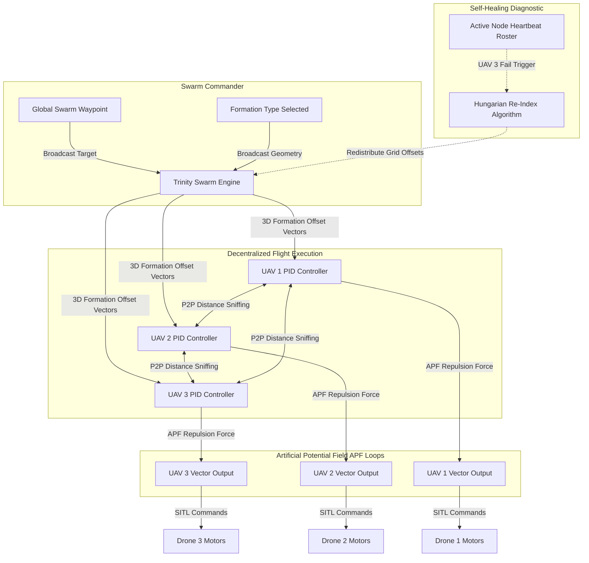

# 🛸 Project TRINITY: Autonomous Swarm Intelligence Coordination Engine
**Multi-UAV Collective Autonomy Framework Powered by 3D Formation Control, Artificial Potential Fields (APF), & Self-Healing Decentralized Meshes**

[](https://github.com/yogesh031020/-Project-TRINITY)
[](https://github.com/yogesh031020/-Project-TRINITY)
[](docs/ROS2_Gazebo_Integration_Roadmap.md)
[](https://github.com/yogesh031020/-Project-TRINITY)

---

## 🚀 Project Overview
**Project TRINITY** is an advanced swarm autonomy framework designed to coordinate large-scale UAV formations to operate as a single, cohesive, decentralized unit. 

Moving beyond single-drone autonomy, TRINITY implements **Collective Swarm Intelligence** where multiple aerial agents coordinate spatial offsets in 3D, execute real-time collision-free path planning via an **Artificial Potential Field (APF)**, and dynamically heal their mesh structure in the event of hardware failures or network dropouts.

This repository contains the verified mathematical 3D simulation engine, formation diagnostics, and a systems engineering roadmap for integration with **ROS 2 Humble** and **Gazebo SITL**.

---

## 🧠 System Architecture & Data Flow
The swarm coordination engine maps collective flocking forces and geometric structures, distributing actuation targets to each individual drone:



---

## 🛠️ Systems Engineering: Key Swarm Features

### 1. Dynamic 3D Geometric Formations
The engine uses high-frequency transformation matrices to dynamically scale and rotate 3D formations relative to the swarm leader:
*   **V-SHAPE:** Symmetrical aerodynamic wing configurations.
*   **GRID:** Wide spatial distribution optimized for search and rescue operations.
*   **CIRCLE:** Safe, collision-free holding pattern orbital.
*   **DIAMOND:** Tightly packed geometric configuration for complex obstacle penetration.

### 2. Multi-Agent Collision Avoidance (Artificial Potential Field)
To maintain zero-collision guarantees across dense drone clusters, each UAV calculates local **Artificial Potential Fields (APF)**:
*   **Attractive Forces ($F_{attr}$):** Proportional PID tracking pulls each follower toward its dynamic formation offset coordinate.
*   **Repulsive Forces ($F_{rep}$):** An inverse-square repulsive force triggers whenever another UAV enters the safety radius ($r_{avoid} = 6m$), pushing agents apart before physical contact occurs.

### 3. Fault-Tolerant Self-Healing Mesh
If an active UAV experiences a mechanical error, engine failure, or battery depletion:
1. The **Swarm Commander** detects a lost heartbeat.
2. The engine dynamically re-indexes the offsets of the remaining active swarm roster.
3. The remaining active drones smoothly shift locations to fill the gap, preserving the structural symmetry and flight aerodynamic balance.

---

## ⚙️ ROS 2 & Gazebo Integration Roadmap
We have authored a comprehensive systems architecture roadmap detailing how to port this swarm logic into high-fidelity Gazebo physics environments with PX4 SITL multi-vehicle setups.

> [!TIP]  
> Read the complete architectural overview:  
> 🗺️ **[ROS 2 & Gazebo Integration Roadmap](docs/ROS2_Gazebo_Integration_Roadmap.md)**

---

---

## 🛠️ Step-by-Step "How to Run" & Deployment Guide

This repository contains two execution targets: a high-fidelity ROS 2 / Gazebo interface package, and a verified 3D physical simulation engine.

### Option A: Execute the 3D Swarm Mathematical Simulation (Instant Preview)
To view the flight trajectory, Artificial Potential Field (APF) avoidance vectors, and mid-flight self-healing re-indexing in action immediately without launching a full ROS 2 environment:
```bash
# Run the standalone physics coordination engine
python3 src/swarm_engine.py
```
*This will print step-by-step 3D coordinate trajectories showing the swarm taking off, flying towards coordinate (120, 120, 15), experiencing a critical hardware failure on UAV_3 at step 20, dynamically re-indexing to CIRCLE hold, and successfully acquiring target destination with zero collisions.*

---

### Option B: Compile & Deploy inside a ROS 2 Workspace (Humble/Jazzy)
To compile the coordination nodes and deploy the decentralized controller stack in your ROS 2 Gazebo SITL workspace, follow these steps:

#### 1. Setup Your ROS 2 Workspace
Create a standard ROS 2 development workspace and clone the package into the source folder:
```bash
mkdir -p ~/trinity_ws/src
cd ~/trinity_ws/src
git clone https://github.com/yogesh031020/-Project-TRINITY.git trinity_swarm
```

#### 2. Install Package Dependencies
Ensure your workspace includes standard Python ROS 2 packaging templates and px4 message headers:
```bash
cd ~/trinity_ws
rosdep update
rosdep install --from-paths src --ignore-src -r -y
```

#### 3. Build & Source the Package
Compile the Python nodes using the standard colcon build tool and source the local overlay:
```bash
colcon build --packages-select trinity_swarm
source install/setup.bash
```

#### 4. Launch the Swarm Coordination Engine
Execute the centrally-distributed swarm commander and spawn the 3x isolated UAV controller instances inside active namespaces (`/uav_1`, `/uav_2`, `/uav_3`):
```bash
ros2 launch trinity_swarm swarm_launch.py
```
*You can now publish global destination waypoints to `/swarm/target_waypoint` and dynamically change active formations in mid-flight by sending String commands ('CIRCLE', 'DIAMOND', 'V-SHAPE') to `/swarm/formation_cmd`!*

---

## 📂 Repository Directory Layout

```directory
-Project-TRINITY/
├── config/
│   # Swarm launch parameters and namespace configurations (planned)
├── docs/
│   └── ROS2_Gazebo_Integration_Roadmap.md # ROS2 & Gazebo Spawning and DDS Architecture
├── sim/
│   └── swarm_mission.log                  # Flight telemetry, self-healing, and APF logs
├── src/
│   └── swarm_engine.py                    # Verified 3D Swarm Simulation Engine
├── LICENSE                                # MIT License
└── README.md                              # Core project presentation and showcase
```

---

### **Aeronautical & Autonomy Systems Engineering Portfolio**
*   **Developed by:** Yogesh E S - Aeronautical Systems Engineer
*   **Contact/Portfolio:** [GitHub Profile](https://github.com/yogesh031020)
