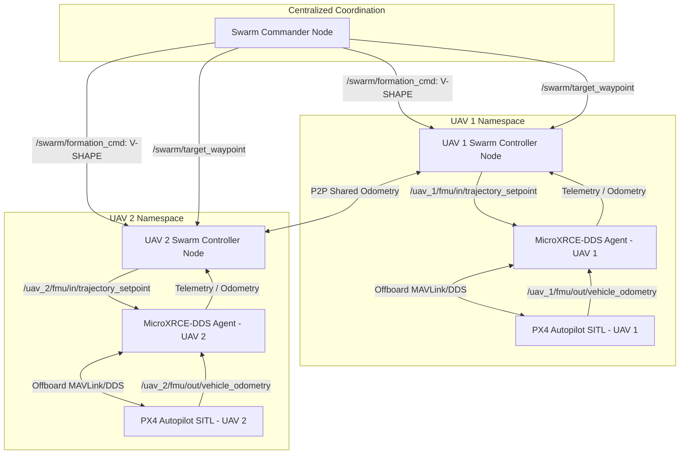
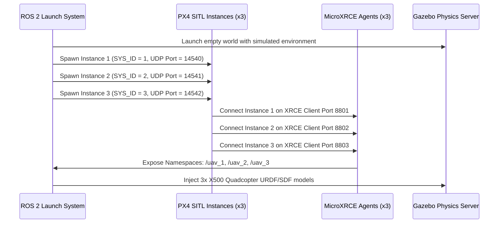

# 🗺️ Project TRINITY: ROS 2 & Gazebo Humble Swarm Integration Roadmap
**Industrial Systems Engineering Architecture for Multi-UAV Simulation, Decentralized Communication, & Self-Healing Formations**

---

## 1. Architectural Overview
To transition the **TRINITY Swarm Engine** from a lightweight mathematical model to a high-fidelity physical simulation, we leverage **ROS 2 (Humble/Jazzy)** as the communication middleware and **Gazebo (Harmonic/Classic)** alongside the **PX4 Autopilot Software-in-the-Loop (SITL)** as the physics and flight control engine.

The system utilizes a **decentralized-coordinated** architecture: each drone runs an independent local flight controller and a dedicated ROS 2 navigation node, while a centralized or distributed **Swarm Commander** orchestrates formation shapes, target coordinates, and mesh state-health.

---

## 2. ROS 2 Topic & Node Topology
Each drone is isolated in its own ROS 2 namespace (`/uav_1`, `/uav_2`, etc.) to prevent packet collisions. The nodes interact using best-effort volatile DDS topics for high-frequency telemetry and reliable services for formation changes.

### Mapped Network Topics & Interfaces
| Topic Name | Message Type | Direction | Description |
| :--- | :--- | :--- | :--- |
| `/swarm/formation_cmd` | `std_msgs/msg/String` | Commander ➔ UAVs | Dictates target geometry (V-SHAPE, GRID, CIRCLE, DIAMOND) |
| `/swarm/target_waypoint` | `geometry_msgs/msg/Point` | Commander ➔ UAVs | Sets the global mission goal for the swarm leader |
| `/swarm/mesh_status` | `diagnostic_msgs/msg/DiagnosticArray` | UAVs ➔ Commander | Real-time heartbeats and battery indices for self-healing |
| `[ns]/fmu/in/trajectory_setpoint` | `px4_msgs/msg/TrajectorySetpoint` | Controller ➔ PX4 | Sends 3D target coordinates and yaw angles to autopilot |
| `[ns]/fmu/out/vehicle_odometry` | `px4_msgs/msg/VehicleOdometry` | PX4 ➔ Controller | High-frequency telemetry (Position, Velocity, Acceleration) |

---

## 3. Gazebo + PX4 SITL Multi-Vehicle Spawn Architecture
Spawning multiple vehicles in Gazebo requires allocating unique ports and system IDs to prevent telemetry cross-talk.

### Spawn Configuration Matrix
To launch three drones cleanly in simulation, each instance operates under the following port mapping:

*   **UAV 1 (Leader):**
    *   Namespace: `/uav_1` | System ID: `1`
    *   PX4 TCP port: `4560` | MAVLink UDP port: `14540`
    *   MicroXRCE DDS Client port: `8801`
*   **UAV 2 (Follower 1):**
    *   Namespace: `/uav_2` | System ID: `2`
    *   PX4 TCP port: `4561` | MAVLink UDP port: `14541`
    *   MicroXRCE DDS Client port: `8802`
*   **UAV 3 (Follower 2):**
    *   Namespace: `/uav_3` | System ID: `3`
    *   PX4 TCP port: `4562` | MAVLink UDP port: `14542`
    *   MicroXRCE DDS Client port: `8803`

---

## 4. Swarm Control Algorithms
The swarm controllers translate collective boids directives into precise PID setpoints:

### A. Leader-Follower Geometric Offsets
Followers calculate their target position ($P_{target,i}$) based on the leader's current position ($P_{leader}$), the heading angle ($\theta$), and the geometric offset ($\Delta X_i, \Delta Y_i$):

$$P_{target,i} = P_{leader} + \mathbf{R}(\theta) \cdot \begin{bmatrix} \Delta X_i \\ \Delta Y_i \\ 0 \end{bmatrix}$$

Where $\mathbf{R}(\theta)$ is the 2D rotation matrix aligning the formation with the swarm's flight path:

$$\mathbf{R}(\theta) = \begin{bmatrix} \cos\theta & -\sin\theta & 0 \\ \sin\theta & \cos\theta & 0 \\ 0 & 0 & 1 \end{bmatrix}$$

### B. Multi-Agent Collision Avoidance (Artificial Potential Field)
To prevent agents from colliding mid-flight, each controller runs an **Artificial Potential Field (APF)** calculation. 
- The target waypoint acts as an **attractive force**:
  $$\vec{F}_{attr} = K_{attr} \cdot (P_{target,i} - P_{i})$$
- Nearby agents (distance $d_{ij} < r_{avoid}$) exert a **repulsive force**:
  $$\vec{F}_{rep} = \sum_{j \neq i} K_{rep} \cdot \left(\frac{1}{d_{ij}} - \frac{1}{r_{avoid}}\right) \cdot \frac{\vec{u}_{ji}}{d_{ij}^2}$$
- The net control force directs the PID loops:
  $$\vec{F}_{net} = \vec{F}_{attr} + \vec{F}_{rep}$$

---

## 5. Fault-Tolerance & Self-Healing Logic
If an agent drops offline (due to mechanical failure or low battery):
1. The **Swarm Commander** detects a heartbeat timeout on `/swarm/mesh_status`.
2. The commander updates the active agent roster (e.g., removing `UAV_3`).
3. A reallocation index mapping is triggered using the **Hungarian Assignment Algorithm**.
4. The remaining active agents dynamically shift to fill the gap, re-indexing offsets to preserve structural balance and flight safety.

---

## 6. Implementation Action Plan
1. **Toolchain Setup:** Install Ubuntu 22.04 LTS, ROS 2 Humble, PX4 Autopilot Source, and Gazebo Garden.
2. **PX4 Configurations:** Compile PX4 SITL models (`make px4_sitl default`).
3. **Multi-Launch File:** Write a `swarm_launch.py` script that handles Gazebo startup, model spawning, and micro-DDS bridges.
4. **Swarm Node Programming:** Implement the `swarm_engine.py` logic inside a custom ROS 2 python package (`trinity_swarm`).
5. **Validation:** Execute takeoff, V-shape flight, obstacle penetration, and dynamic drone failure in Gazebo simulation!
